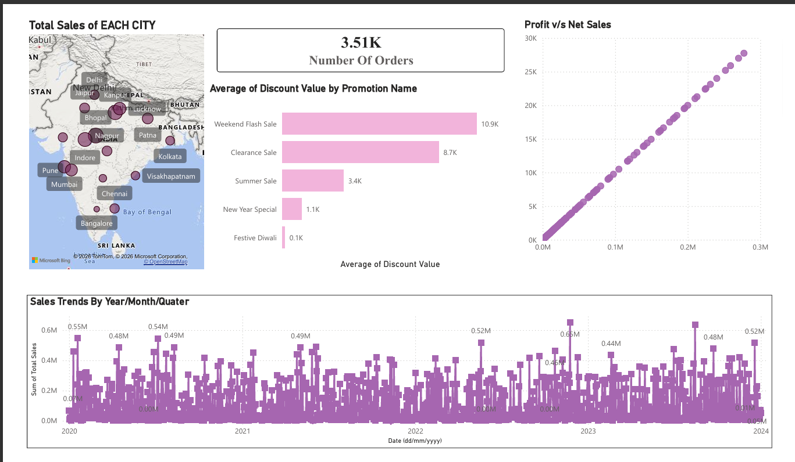
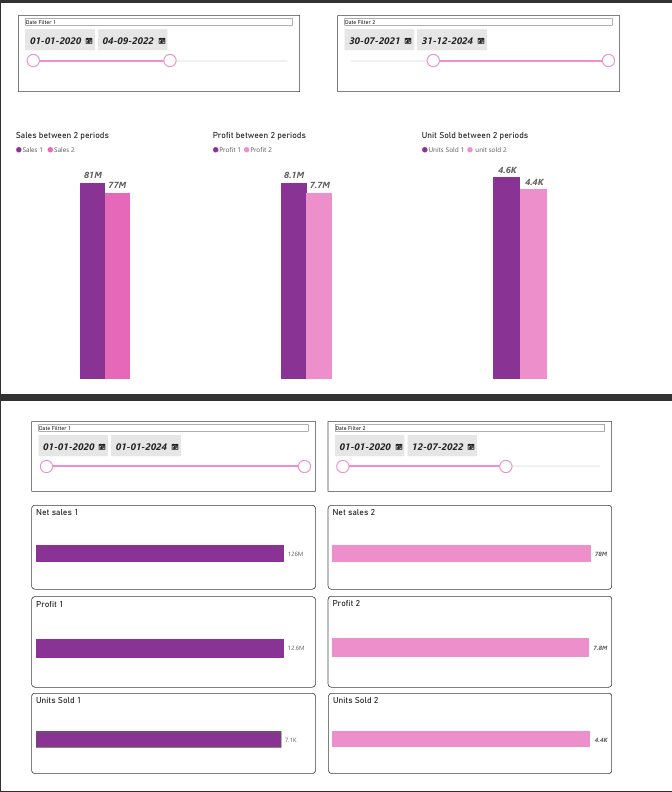
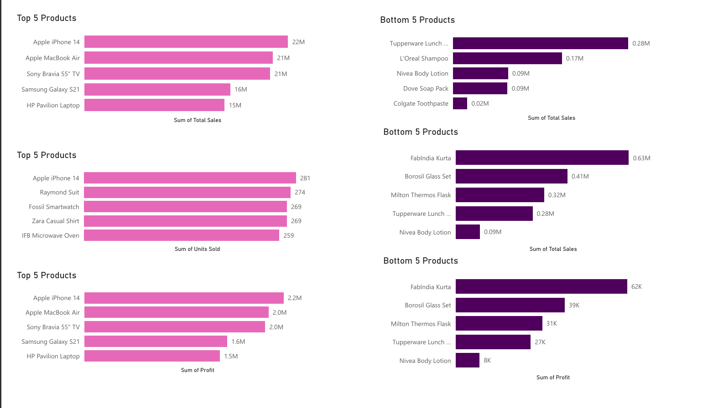
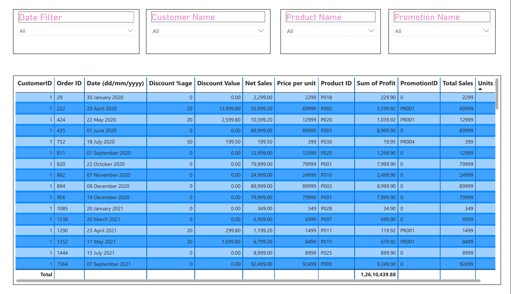

# Retail-Sales-Analysis-PowerBI
# Retail Sales Analysis Dashboard (Power BI)

 Project Overview

Developed an interactive Power BI dashboard to analyze retail sales data for an electronics store.

The dashboard helps business stakeholders understand:

- Sales Performance
- Profitability
- Product Performance
- Promotional Effectiveness
- Regional Sales Trends

---
## Tools Used

- Power BI Desktop
- Power Query
- DAX
---
##  Dataset
Retail sales dataset containing:

- Orders
- Products
- Customers
- Promotions
- Cities
- Sales
- Profit
- Discounts

---

##  Business Questions Answered

1. Top 5 Products by Sales

2. Bottom 5 Products by Sales

3. Sales Trend Analysis

4. Profit vs Net Sales Relationship

5. Sales Comparison Between Two Time Periods

6. Profit Comparison Between Two Time Periods

7. Units Sold Comparison Between Two Time Periods

8. Average Discount by Promotion

9. Sales by City

---

##  Power BI Concepts Used

- Star Schema
- Data Modeling
- Fact & Dimension Tables
- Primary Key / Foreign Key Relationships
- Power Query
- DAX Measures
- KPI Cards
- Interactive Slicers

---

##  Dashboard Preview
## 📷 Dashboard Preview

### Executive Dashboard

### Sales Trends

### Top & Bottom Products

### Top & Bottom Products

## Author
Aastha Gupta
